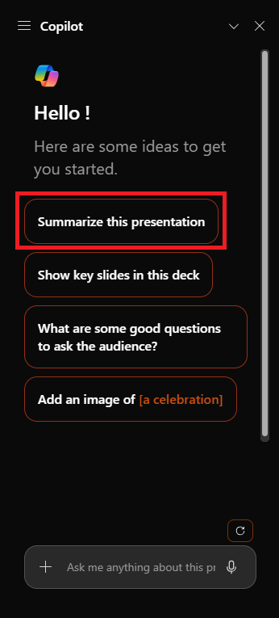

# Identifier les informations clés et résumer avec Copilot dans PowerPoint

Microsoft 365 Copilot dans PowerPoint est une fonctionnalité basée sur l’IA qui peut vous aider à créer, à concevoir et à mettre en forme vos diapositives.  Vous pouvez taper ce que vous avez l’intention de transmettre avec votre présentation et Copilot vous aide à le faire.

Copilot peut vous aider à passer la diapositive vide initiale et à vous déplacer dans le bon sens. Pour commencer à utiliser Copilot dans PowerPoint, vous pouvez ouvrir le volet **Copilot** en sélectionnant l’icône Copilot dans l’onglet **Accueil** du ruban.

Dans le volet Copilot, vous pouvez demander un résumé de la présentation ou poser des questions sur le contenu des diapositives. Dans l’exemple suivant, nous commençons par une requête de base pour résumer la présentation et ajoutons d’autres éléments pour rendre le prompt plus efficace.

## Commençons

Tout d’abord, téléchargez **_[Mystic Spice Premium Chai Market Analysis Presentation.pptx](https://go.microsoft.com/fwlink/?linkid=2268768)_** et enregistrez le fichier dans votre **dossier OneDrive** si vous ne l’avez pas encore fait.

> [!NOTE]
> Prompt de départ :
>
> _Résume cette présentation PowerPoint._

Dans ce prompt simple, vous commencez par l’**objectif** de base : _résumer une présentation PowerPoint_. Toutefois, il n’y a aucune information sur la raison pour laquelle la présentation doit être résumée ni sur la finalité du résumé.

| Élément | Exemple |
| :------ | :------- |
| **Invite de base :** commencez par un **objectif** | **Résume cette présentation PowerPoint.** |
| **Bon prompt :** ajouter un **contexte** | L’ajout de **contexte** peut aider Copilot à comprendre la finalité du résumé et à adapter la réponse en conséquence. _« … pour donner à mon patron une vue d’ensemble des points principaux avant un rendez-vous avec son client. »_ |
| **Meilleur prompt :** spécifier la ou les **sources** | L’ajout de **sources** peut aider Copilot à comprendre quelle présentation ou quelle partie il doit résumer et à fournir une réponse plus précise. _« ...diapositives 5 à 10 de cette présentation PowerPoint… »_ |
| **Meilleur prompt :** définir des **attentes** claires | Enfin, ajouter des **attentes** peut aider Copilot à comprendre comment mettre en forme le résumé et quel niveau de détail est requis. _« Mets en forme les points principaux sous forme de liste à puces et utilise un ton professionnel. »_ |

> [!NOTE]
> **Prompt créé **:
>
> _Résume les diapositives 5 à 10 de cette présentation PowerPoint pour donner à mon patron une vue d’ensemble des points principaux avant un rendez-vous avec son client. Merci de mettre en forme les points principaux sous forme de liste à puces et d’utiliser un ton professionnel._

Dans cette invite, l’**objectif**, le **contexte**, la **source**, et les **attentes** sont tous fournis, ce qui donne à Copilot suffisamment d’informations pour générer une réponse répondant à vos besoins.

## Explorer davantage

Essayez le prompt final que nous avons créé, mais en utilisant votre propre présentation PowerPoint. Personnalisez le **contexte**, les **sources** et les **attentes** afin d’obtenir ce dont vous avez besoin à partir de la présentation, sans élément supplémentaire dont vous n’avez pas besoin.

> [!IMPORTANT]
> Cette fonctionnalité est disponible pour les clients disposant d’une licence Microsoft 365 Copilot ou d’une licence Copilot Pro. Pour plus d’informations, consultez [Bienvenue dans Copilot dans PowerPoint](https://support.microsoft.com/office/welcome-to-copilot-in-powerpoint-57133c75-24c0-4519-8096-d0dadf25fb8d).
