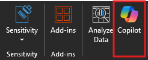

# Repérer les tendances et visualiser des données avec Copilot dans Excel

Microsoft 365 Copilot dans Excel vous aide à exploiter davantage vos données dans les tableaux Excel en générant des suggestions de colonnes de formule, en affichant des informations dans des graphiques et des tableaux croisés dynamiques et en mettant en évidence les parties intéressantes des données.

Dans Excel, sélectionnez **Copilot**  dans le ruban pour ouvrir le volet de conversation.

Pour utiliser Copilot dans Excel, vos données doivent être mises en forme de l’une des manières suivantes :

- Sous forme de tableau Excel
- Sous forme de plage de données

Vous pouvez créer un tableau ou convertir une plage de cellules en tableau si vous disposez d’une plage de données en procédant comme suit :

1. Sélectionnez la cellule ou la plage de données.

1. Sélectionnez  **Accueil > Mettre en forme en tant que tableau**.

1. Dans la boîte de dialogue  **Mettre en forme en tant que tableau** , cochez la case à côté de  **Mon tableau comporte des en-têtes**  si vous voulez que la première ligne de la plage soit la ligne d’en-tête.

1. Sélectionnez **OK**.

Si vous préférez conserver vos données dans une plage et ne pas les convertir en tableau, elles devront répondre à toutes les exigences suivantes :

- Une seule ligne d’en-tête.
- Les en-têtes sont uniquement sur les colonnes, et non sur les lignes.
- Les en-têtes sont uniques ; aucun en-tête en double.
- Aucun en-tête vide.
- Les données sont mises en forme de manière cohérente.
- Aucun sous-total.
- Aucune ligne ou colonne vide.
- Aucune cellule fusionnée.

Dans l’exemple suivant, nous commençons par une requête de base pour analyser un tableau et ajoutons progressivement des éléments afin de rendre l’invite plus efficace.

## Commençons

Tout d’abord, téléchargez **_[Contoso Chai Tea market trends 2023.xlsx](https://go.microsoft.com/fwlink/?linkid=2268822)_** et enregistrez le fichier dans votre dossier **OneDrive** si vous ne l’avez pas encore fait.

Ouvrez la feuille de calcul dans Excel, puis ouvrez le volet **Copilot** en sélectionnant l’icône Copilot dans l’onglet **Accueil** du ruban. Entrez les prompts ci-dessous et suivez les instructions.

> [!NOTE]
> Prompt de départ :
>
> _Analyse ce tableau dans Excel._

Avec ce prompt simple, vous commencez par l’**Objectif** de base : _analyser un tableau Excel._ Toutefois, il n’existe aucune information sur la raison pour laquelle le tableau doit être résumé ou à quoi servira le résumé.

| Élément | Exemple |
| :------ | :------- |
| **Invite de base :** commencez par un **objectif** | **Analyse ce tableau dans Excel.** |
| **Bon prompt :** ajouter un **contexte** | L’ajout de **contexte** peut aider Copilot à comprendre l’objectif de l’analyse et à ajuster la réponse en conséquence. _« Nous recherchons les produits les plus vendus de mai à août, pour les ventes de chai artisanal et les ventes de chai préparé »._ |
| **Meilleur prompt :** spécifier la ou les **sources** | L’ajout de **sources** peut aider Copilot à préciser l’étendue de la recherche en lui indiquant d’utiliser des informations ou des plages de dates spécifiques. _« ...de mai à août, pour les ventes de chai artisanal et les ventes de chai préparé... »_ |
| **Meilleur prompt :** définir des **attentes** claires | Enfin, ajouter des **attentes** peut aider Copilot à comprendre comment mettre en forme le résumé et quel niveau de détail est requis. _« Résume le produit le plus vendu pour chaque mois. »_ |

> [!NOTE]
> **Prompt créé **:
>
> _Analyse ce tableau dans Excel. Nous recherchons les produits les plus vendus de mai à août, pour les ventes artisanales de chai ou les ventes de chai préparé. Résume le produit le plus vendu pour chaque mois._

Ce prompt donne à Copilot tout ce dont il a besoin pour trouver une bonne réponse, notamment l’**objectif**, le **contexte**, la **source** et les **attentes**.

## Explorer davantage

Essayez l’invite finale que nous avons créée et d’autres invites avec votre propre tableau Excel. Voici quelques suggestions pour des prompts à essayer. Copiez-les et ajoutez le **contexte**, les **sources** et les **attentes**.  

- Trace les ventes par catégorie au fil du temps.

- Affiche le total des ventes pour chaque produit.

- Affiche le total des ventes publicitaires pour chaque région l’année dernière.

> [!IMPORTANT]
> Cette fonctionnalité est disponible pour les clients disposant d’une licence Microsoft 365 Copilot ou d’une licence Copilot Pro. Pour en savoir plus sur les tableaux Excel et savoir comment les créer, consultez [Créer un tableau dans Excel](https://support.microsoft.com/office/bf0ce08b-d012-42ec-8ecf-a2259c9faf3f).
