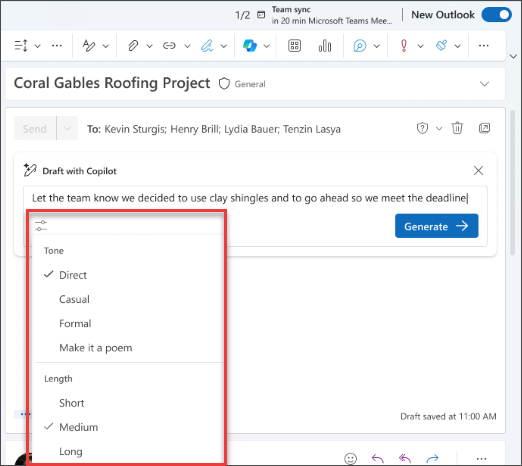
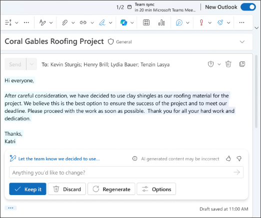

Copilot dans Outlook facilite la gestion des boîtes de réception à l’aide de l’IA pour vous aider à écrire rapidement des e-mails et à résumer brièvement de longs fils de discussion par e-mail. Il combine la puissance des grands modèles de langage (LLMs) avec les données Outlook pour vous aider à maintenir votre productivité sur votre lieu de travail. Il peut résumer des fils d’e-mails (également connus sous le nom de conversations), en extrayant les points clés de plusieurs messages.

> [!NOTE]
> La création de brouillon dans Outlook pour Microsoft 365 est actuellement disponible dans la nouvelle version d’Outlook pour Windows, Outlook sur le web et Outlook.com. Si vous disposez de la version classique d’Outlook, [installez la nouvelle version d’Outlook](https://support.microsoft.com/office/start-using-new-outlook-for-windows-4395454d-cb2f-4c16-bb24-fa4bb36650ae). Si vous ne parvenez pas à y accéder, contactez votre administrateur informatique.

Copilot dans Outlook peut vous aider à rédiger rapidement un e-mail ou une réponse à une conversation existante.

1. Dans Outlook, sélectionnez **Accueil > Nouveau message > Courrier**.

1. Pour créer un nouveau message, sélectionnez **l’icône Copilot** dans la barre d’outils.

1. Sélectionnez **Brouillon avec Copilot** dans le menu déroulant.

    

1. **Rédigez votre prompt** dans la zone de texte Copilot.

1. Sélectionnez **Générer des options** pour choisir la longueur et le ton souhaités.

    

1. Lorsque vous avez terminé, sélectionnez **Générer**. Copilot rédige votre message.

1. Relisez le message. Si ce n’est pas tout à fait ce que vous souhaitez, choisissez **Régénérer le brouillon** et Copilot créera une nouvelle version.

1. Pour recommencer, modifiez votre invite et sélectionnez **Générer** à nouveau.

1. Lorsque vous estimez le résultat satisfaisant, sélectionnez **Conserver**.

1. Modifiez le brouillon autant que nécessaire, puis sélectionnez **Envoyer**.

    

## Commençons

> [!NOTE]
> Prompt de départ :
>
> _Rédige un nouvel e-mail._

Dans ce prompt simple, vous commencez par l’**objectif** de base : _rédiger un nouvel e-mail_. Toutefois, il n’y a pas d’informations sur l’objet de l’e-mail, le ou les destinataires ou encore son style.

| Élément | Exemple |
| :------ | :------- |
| Prompt de base :  Commencer par un **objectif** | **_Rédige un nouvel e-mail._** |
| Prompt correct :  Ajouter un **contexte** | L’ajout de **contexte** peut aider Copilot à comprendre de quoi doit parler l’e-mail et à qui il est destiné.  «  _...à mon client, Allan Deyoung, concernant le statut de son ticket de support._  » |
| Prompt amélioré :  Spécifier la ou les **source(s)** | L’ajout de **sources** peut aider Copilot à savoir où rechercher des informations spécifiques.  «  _...Consulte mes e-mails pour obtenir les informations les plus récentes sur le ticket #1928374655._  » |
| Prompt le plus efficace :  Définir des **attentes** claires | Enfin, ajouter des **attentes** peut aider Copilot à comprendre comment vous souhaitez que le document soit écrit et mis en forme.  « _L’e-mail doit être professionnel et technique, mais écrit avec empathie._  » |

> [!NOTE]
> **Prompt créé **:
>
> _Rédige un nouvel e-mail à mon client, Allan Deyoung, concernant le statut de son ticket de support. Consulte mes e-mails pour obtenir les informations les plus récentes sur le ticket #1928374655. L’e-mail doit être professionnel et technique, mais écrit avec empathie._

Copilot dispose de toutes les informations dont il a besoin pour vous donner une réponse efficace, grâce à l’**objectif**, au **contexte**, à la **source** et aux **attentes** que contient ce prompt. 

> [!IMPORTANT]
> Pour le moment, Copilot dans Outlook prend uniquement en charge les comptes professionnels ou scolaires et les comptes Microsoft utilisant des adresses e-mail outlook.com, hotmail.com, live.com et msn.com. Tout compte Microsoft utilisant un compte provenant d’un fournisseur de messagerie tiers, tel que Gmail, Yahoo ou iCloud, peut utiliser Outlook, mais il n’a pas accès aux fonctionnalités Copilot dans Outlook. Pour plus d’informations, consultez [Rédiger un e-mail avec Copilot dans Outlook](https://support.microsoft.com/office/draft-an-email-message-with-copilot-in-outlook-3eb1d053-89b8-491c-8a6e-746015238d9b).