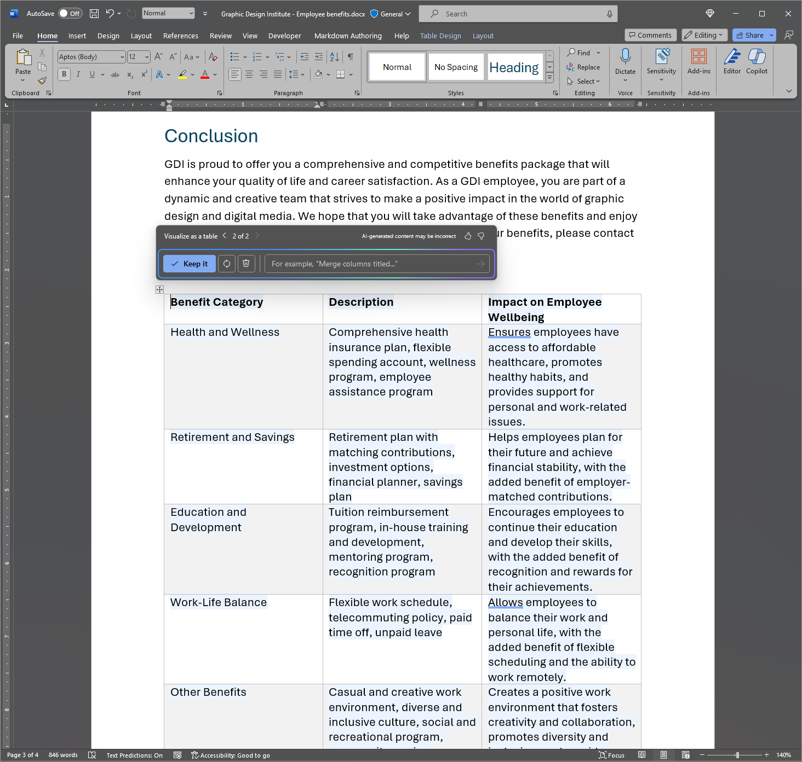

Microsoft 365 Copilot dans Word vous permet de garder le fil de vos idées tout en rédigeant un nouveau contenu et de le remanier une fois que vous avez mis vos idées par écrit. Copilot peut réécrire votre texte, et notamment en adapter le ton. Copilot peut également transformer votre texte en tableau modifiable. Suivez les étapes pour transformer votre contenu dans Word :

## Réécrire pour le ton

1. Sélectionnez le texte que vous souhaitez que Copilot réécrive.

1. Dans la marge gauche en regard de votre texte, sélectionnez l’icône **Copilot**.

1. Dans le menu Copilot de la marge gauche, sélectionnez **Réécrire**.

1. Copilot vous montre les options réécrites parmi lesquelles vous pouvez faire votre choix.

1. Sélectionnez **Remplacer** pour utiliser le texte révisé, **Insérer ci-dessous** pour insérer le texte réécrit sous le texte actuel, **Régénérer** pour régénérer les suggestions de Copilot ou **Ajuster le ton** pour ajuster le texte réécrit selon le ton recherché.

    

## Texte en tableau

1. Sélectionnez le texte que vous souhaitez que Copilot convertisse en tableau.

1. Dans la marge gauche en regard de votre texte, sélectionnez l’icône **Copilot**.

1. Dans le menu Copilot de la marge gauche, sélectionnez **Visualiser en tant que tableau**.

1. Copilot vous montre à quoi ressemble le tableau.

1. Sélectionnez **Conserver** pour insérer le tableau dans votre document, **Régénérer** pour régénérer le tableau de Copilot ou **Abandonner** pour supprimer le tableau.

1. Pour perfectionner le tableau, entrez des détails dans la boîte de composition de Copilot pour indiquer ce qu’il faut changer dans le tableau.

    1. La modification de la mise en forme d’un tableau n’est pas prise en charge à l’aide de la zone de composition, mais la mise en forme du tableau peut être modifiée à l’aide des options de tableau dans le ruban Word.

    

Dans l’exemple suivant, nous commençons par une invite simple pour transformer du texte en tableau et nous ajoutons des éléments au fur et à mesure. Suivez la procédure avec l’exemple en utilisant vos propres données.

## Commençons

Tout d’abord, téléchargez **_[Graphic Design Institute - Employee Benefits.docx](https://go.microsoft.com/fwlink/?linkid=2268825)_** et enregistrez le fichier dans votre **dossier OneDrive** si vous ne l’avez pas encore fait.

Ouvrez le document dans Word et mettez en surbrillance tout le texte du document (appuyez sur **Ctrl-A**). Dans le menu Copilot de la marge gauche, sélectionnez **Visualiser en tant que tableau**. Après avoir généré le tableau, continuez à demander à Copilot d’affiner vos résultats à l’aide des prompts suivants.

> [!NOTE]
> Prompt de départ :
>
> _Une représentation sous forme de tableau._

Dans cette invite simple, vous commencez par l’**objectif** de base : _transformer du texte en tableau._ Toutefois, il n’y a aucune indication sur les informations souhaitées dans le tableau ou sur la raison pour laquelle vous souhaitez un tableau.

| Élément | Exemple |
| :------ | :------- |
| Prompt de base :  Commencer par un **objectif** | **_Une représentation sous forme de tableau._** |
| Prompt correct :  Ajouter un **contexte** | L’ajout de **contexte** peut aider Copilot à comprendre le type de données à afficher et à quelle fin elles seront utilisées  « _Nous avons besoin d’un moyen clair de communiquer ces avantages à des employés potentiels._  » |
| Prompt amélioré :  Spécifier la ou les **source(s)** | La **source** de cet exemple est l’intégralité du texte du document **Graphic Design Institute - Employee Benefits.docx**. |
| Prompt le plus efficace :  Définir des **attentes** claires | Enfin, ajouter des **attentes** peut aider Copilot à comprendre comment vous souhaitez que le tableau soit organisé et rédigé.  « _Merci d’inclure une troisième colonne qui décrit clairement l’avantage pour l’employé et l’impact sur son bien-être._  » |

> [!NOTE]
> **Prompt créé **:
>
> _Une représentation sous forme de tableau. Nous avons besoin d’un moyen clair de communiquer ces avantages à des employés potentiels. Merci d’inclure une troisième colonne qui décrit clairement l’avantage pour l’employé et l’impact sur son bien-être._

Ce prompt donne à Copilot tout ce dont il a besoin pour trouver une bonne réponse, notamment l’**objectif**, le **contexte**, la **source** et les **attentes**.

> [!Important]
> Cette fonctionnalité est disponible pour les clients disposant d’une licence Microsoft 365 Copilot ou d’une licence Copilot Pro. Pour plus d’informations, consultez [Transformer votre contenu avec Copilot dans Word](https://support.microsoft.com/office/transform-your-content-with-copilot-in-word-923d9763-f896-4da7-8a3f-5b12c3bfc475).