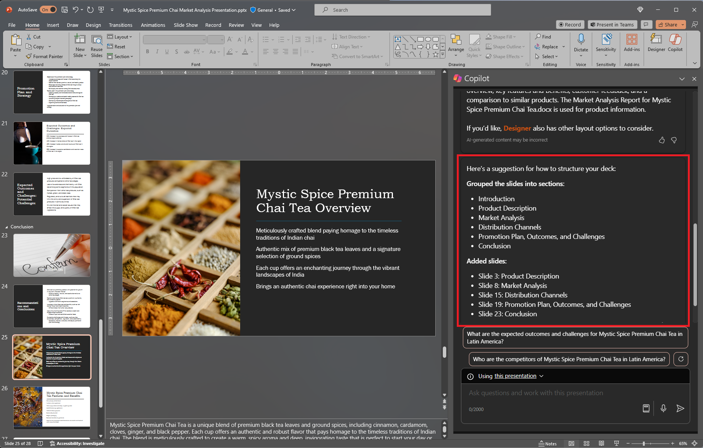

Pour commencer à converser avec Copilot dans PowerPoint, vous pouvez ouvrir le volet **Copilot** en sélectionnant l’icône Copilot dans l’onglet **Accueil** du ruban.

Lorsque vous créez une présentation, vous ne savez peut-être pas bien comment organiser vos diapositives en sections. Copilot dans PowerPoint peut vous aider. Vous pouvez demander à Copilot d’organiser votre présentation. Il les organise en sections, puis ajoute des diapositives de titres de sections. 

1. Dans le ruban, sélectionnez l’icône Copilot.

1. Un volet Copilot s’ouvre du côté droit de votre écran.

1. Tapez **Organiser cette présentation** dans le champ d’invite en bas du volet Copilot.

1. Sélectionnez **Envoyer**.

Si vous n’aimez pas ce que fait Copilot, vous pouvez simplement sélectionner le **bouton Annuler** du ruban pour restaurer votre support de présentation à son état précédent. 

## Commençons

Si vous ne l’avez pas encore fait, téléchargez les fichiers suivants et enregistrez-les dans votre **dossier OneDrive** afin qu’ils apparaissent dans votre liste d’éléments utilisés récemment :

- **_[Mystic Spice Premium Chai Market Analysis Presentation.pptx](https://go.microsoft.com/fwlink/?linkid=2268768)_**
- **_[Mystic Spice Premium Chai Tea product description.docx](https://go.microsoft.com/fwlink/?linkid=2268929)_**

> [!NOTE]
> Prompt de départ :
>
> _Organise cette présentation PowerPoint._

Dans ce prompt simple, vous commencez par l’**objectif** de base : _organiser un PowerPoint_. Toutefois, il n’y a aucune information sur la raison pour laquelle la présentation doit être résumée ni sur la finalité du résumé.

| Élément | Exemple |
| :------ | :------- |
| Prompt de base :  Commencer par un **objectif** | **Organise cette présentation PowerPoint.** |
| Prompt correct :  Ajouter un **contexte** | L’ajout de **contexte** peut aider Copilot à comprendre la façon dont vous souhaitez organiser le jeu PowerPoint et la raison pour laquelle vous souhaitez le faire.  «  _...pour un examen de produit la semaine prochaine par la direction_ » |
| Prompt amélioré :  Spécifier la ou les **source(s)** | L’ajout de **sources** peut aider Copilot à regarder dans un emplacement spécifique, tel que les spécifications de produit ou un catalogue.  « _Consulte le document **/Mystic Spice Premium Chai Tea product description.docx** pour obtenir des informations sur le produit._  » |
| Prompt le plus efficace :  Définir des **attentes** claires | Enfin, ajouter des **attentes** peut aider Copilot à comprendre la structure de la présentation et quel niveau de détail inclure.  « _Organise les diapositives par produit et inclue une vue d’ensemble, une liste de fonctionnalités et d’avantages clés, des commentaires des clients et une comparaison à des produits similaires sur le marché._  » |

> [!NOTE]
> **Prompt créé **:
>
> _Organise cette présentation pour une revue de produit la semaine prochaine par la direction. Consulte le document **/Mystic Spice Premium Chai Tea description.docx** pour obtenir des informations sur le produit. Organise les diapositives par produit et inclue une vue d’ensemble, une liste de fonctionnalités et d’avantages clés, des commentaires des clients et une comparaison avec des produits similaires sur le marché._

Dans cette invite, l’**objectif**, le **contexte**, la **source**, et les **attentes** sont tous fournis, ce qui donne à Copilot suffisamment d’informations pour générer une réponse répondant à vos besoins.

## Explorer davantage

Essayez le prompt final que nous avons créé, mais en utilisant votre propre présentation PowerPoint. Personnalisez le **contexte**, les **sources** et les **attentes** afin d’obtenir ce dont vous avez besoin à partir de la présentation, sans élément supplémentaire dont vous n’avez pas besoin.

> [!IMPORTANT]
> Cette fonctionnalité est disponible pour les clients disposant d’une licence Microsoft 365 Copilot ou d’une licence Copilot Pro. Pour plus d’informations, consultez [Organiser cette présentation avec Copilot dans PowerPoint](https://support.microsoft.com/office/organize-this-presentation-with-copilot-in-powerpoint-a207eea3-7a56-4225-88f1-54dd37cdcf6a).