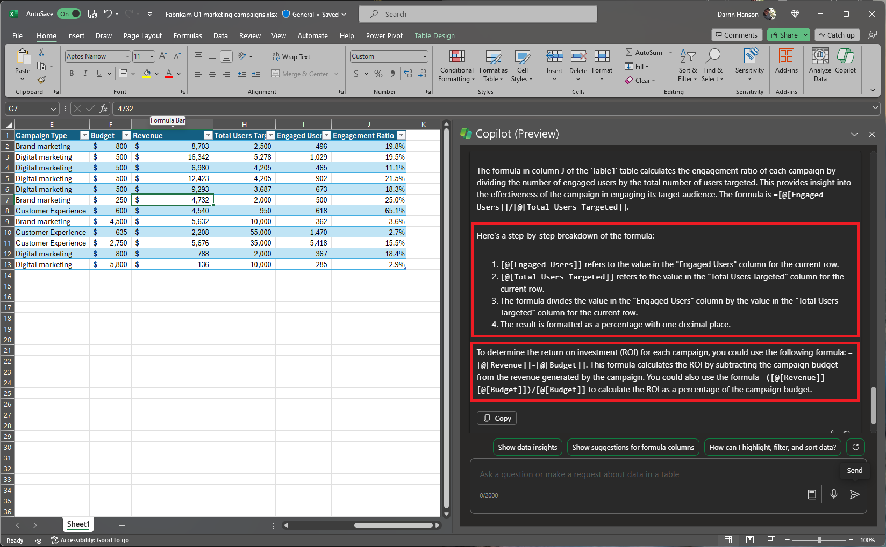

Si vous ne savez pas comment écrire une formule pour une nouvelle colonne, Microsoft 365 Copilot peut rapidement ajouter de nouvelles colonnes comportant des formules basées sur vos données. 

1. Avec vos données sont formatées en tableau, sélectionnez le bouton **Copilot** du ruban.

1. Sélectionnez **Ajouter des colonnes de formules** ou **Afficher des suggestions pour les colonnes de formules**. Vous pouvez également décrire les colonnes que vous souhaitez ajouter en les tapant selon vos propres mots.

1. Copilot fournit des suggestions de formules comportant une explication sur le fonctionnement de chaque formule. Affichez l’explication en sélectionnant **Expliquer la formule**.

1. Sélectionnez Insérer une colonne pour ajouter la colonne de formules dans votre tableau.

> [!IMPORTANT]
> Comme pour tout contenu généré par l’IA, il est important de passer en revue, modifier et vérifier tout ce que Copilot crée pour vous.

## Commençons

Tout d’abord, téléchargez **_[Fabrikam Q1 marketing campaigns.xlsx](https://go.microsoft.com/fwlink/?linkid=2269124)_** et enregistrez le fichier dans votre **dossier OneDrive** si vous ne l’avez pas encore fait.

Ouvrez la feuille de calcul dans Excel, puis ouvrez le volet **Copilot** en sélectionnant l’icône Copilot dans l’onglet **Accueil** du ruban. Entrez les prompts ci-dessous et suivez les instructions.

> [!NOTE]
> Prompt de départ :
>
> _Explique cette formule._

Dans ce prompt simple, vous commencez par l’**objectif** de base : _expliquer une formule Excel_. Toutefois, Copilot ne sait pas de quelle formule il s’agit ou ce que vous ne comprenez pas.

| Élément | Exemple |
| :------ | :------- |
| Prompt de base :  Commencer par un **objectif** | **_Explique cette formule._** |
| Prompt correct :  Ajouter un **contexte** | L’ajout de **contexte** peut aider Copilot à comprendre ce que vous ne comprenez pas à propos de la formule.  « _Nous devons comprendre le calcul de l’engagement utilisateur._  » |
| Prompt amélioré :  Spécifier la ou les **source(s)** | La **source** de ce prompt est supposée être le tableau avec lequel nous travaillons dans Excel, mais vous pouvez être encore plus spécifique.  «  _… à partir de la colonne J du tableau « Table1 » dans la feuille de calcul Excel._  » |
| Prompt le plus efficace :  Définir des **attentes** claires | Enfin, ajouter des **attentes** peut aider Copilot à comprendre comment vous souhaitez que la formule soit expliquée et décomposée.  « _Merci de décomposer la formule étape par étape, avec ses arguments et sa syntaxe. Merci de suggérer des formules supplémentaires qui seraient utiles pour déterminer le retour sur investissement._  » |

> [!NOTE]
> **Prompt créé **:
>
> _Explique la formule de la colonne J du tableau « Table1 » dans la feuille de calcul Excel. Nous devons comprendre le calcul de l’engagement utilisateur. Merci de décomposer la formule étape par étape, avec ses arguments et sa syntaxe. Merci de suggérer des formules supplémentaires qui seraient utiles pour déterminer le retour sur investissement._

Copilot dispose de toutes les informations dont il a besoin pour vous donner une réponse efficace, grâce à l’**objectif**, au **contexte**, à la **source** et aux **attentes** que contient cette invite.

## Explorer davantage

Utilisez ces invites comme point de départ. Copiez et modifiez-les selon vos besoins. 

- Calculez le coût total par produit dans une nouvelle colonne. 

- Ajoutez une colonne calculant le bénéfice total de chaque campagne de marketing en 2022. 

- Ajoutez une colonne calculant le nombre de jours après l’événement de lancement de produit. 

Pour plus d’informations, consultez [Générer des colonnes de formule avec Copilot dans Excel](https://support.microsoft.com/office/generate-formula-columns-with-copilot-in-excel-d866d926-9791-4e5f-be2a-c6dd9e587a47).